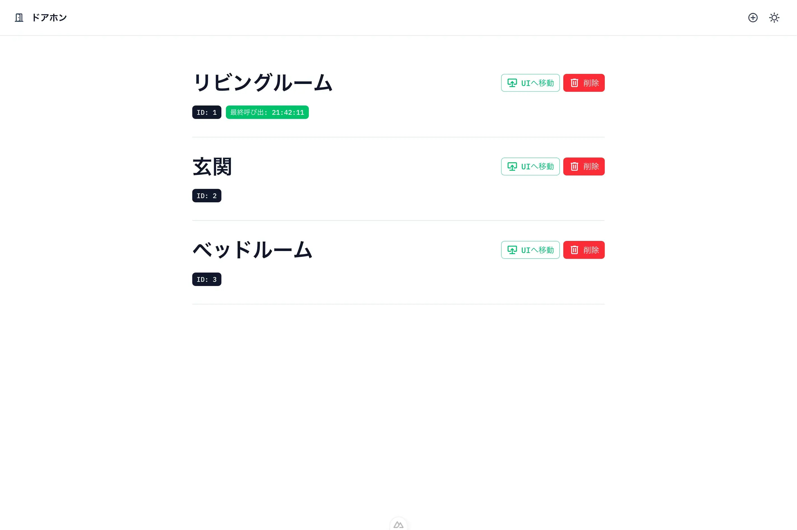
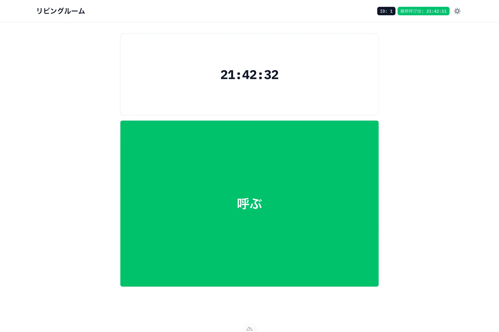

# DoorPhoneOSS
シンプルなドアホンシステム。  
そのうち大改修します。

## 起動
1. 
```sh
git clone https://github.com/makaseloli/DoorPhoneOSS.git
cd DoorPhoneOSS
```
2. /publicにpush.mp3[^1]とring.mp3[^2]を配置する。
3. 
```sh
docker compose build --no-cache
docker compose up
```

[^1]: ドアホン側で再生。
[^2]: ダッシュボード側で再生。

## 機能
http://0.0.0.0:34567/ ではデバイスの追加ができます。  
http://0.0.0.0:34567/doorphone/<id> でドアホン画面を表示できます。

## スクリーンショット


